# eCommerce Technical Task
This is an application which lists products and handles adding / updating / modifying products in the cart.

See more details at the Guides section.

# Prerequisites

## node version >= 18

It is mandatory to have node version 18 at least.

## yarn
It is strongly recommended to use yarn instead of npm.

Installation instructions: https://classic.yarnpkg.com/lang/en/docs/install

## Environment
Linux or Mac is strongly recommended (Any UNIX based OS).

# Installation
First clone the repository from github: https://github.com/kispali80/TechnicalTask
```
git clone git@github.com:kispali80/TechnicalTask.git
```
Next step is go to the TechnicalTask directory and run yarn install
```
yarn install
```

Final step is to run the project
```
yarn start
```

The project page will be loaded in the default browser. The application is ready to use from that point.

# Packages / Tools used on the project
## Create React App
This is the base of everything. It has preconfigured packages and is easy to create web page with React.
Also contains built-in testing functionality and compiler.

This project was bootstrapped with [Create React App](https://github.com/facebook/create-react-app).

## Craco (Create React App Configuration Override)
It is an easy and comprehensible configuration layer for Create React App.
It allows to add / extend configuration for Create React App.

See more details at https://github.com/dilanx/craco

## yarn
It controls the packages, dependencies. It is amazing!

## React Redux Toolkit
It is based on react redux but it is a lightweight version.
This is responsible for handling data in local storage and makes sure that it keeps the data until it is needed.

Also solving the caching strategy.

See more info: https://redux-toolkit.js.org/

## Typescript
Typescript is used on this project.

TypeScript is a strongly typed programming language that builds on JavaScript, giving you better tooling at any scale.

See more details at https://www.typescriptlang.org/

## React JS
React is used as a framework which is built-in with the Create React App.
See more details at https://react.dev/

## Tailwind CSS
It is easy and quick tool to style elements. 
Everything is styled by tailwind.
FYI no SASS related technology is used on this project.

See more info on https://tailwindcss.com/

## Linting
### eslint
Checking for javascript / typescript issues 

### stylelint
Checking for stylesheet related issues - No SASS file used currently on this project

### prettier
Checking for indentation, spacing issues in the code to get the best out of it.

FYI the ";" is removed and not set at the end of the lines as a requirement.
This is a basic configuration. See "semi" rule in .prettierrc.json.

https://prettier.io/docs/en/configuration.html

# Command line tools

## Available Scripts

### `yarn start`

Runs the app in the development mode.\
Open [http://localhost:3000](http://localhost:3000) to view it in the browser.

The page will reload if you make edits.\
You will also see any lint errors in the console.

### `yarn test`

Launches the test runner in the interactive watch mode.\
See the section about [running tests](https://facebook.github.io/create-react-app/docs/running-tests) for more information.

### `yarn build`

Builds the app for production to the `build` folder.\
It correctly bundles React in production mode and optimizes the build for the best performance.

The build is minified and the filenames include the hashes.\
Your app is ready to be deployed!

See the section about [deployment](https://facebook.github.io/create-react-app/docs/deployment) for more information.

### `yarn lint`

Checks for linting issues including prettier rules.

### `yarn tailwind`

Generates a stylesheet which can be imported for other Tools like Storybook, etc

### `yarn eject`

**Note: this is a one-way operation. Once you `eject`, you can’t go back!**

If you aren’t satisfied with the build tool and configuration choices, you can `eject` at any time. This command will remove the single build dependency from your project.

Instead, it will copy all the configuration files and the transitive dependencies (webpack, Babel, ESLint, etc) right into your project so you have full control over them. All of the commands except `eject` will still work, but they will point to the copied scripts so you can tweak them. At this point you’re on your own.

You don’t have to ever use `eject`. The curated feature set is suitable for small and middle deployments, and you shouldn’t feel obligated to use this feature. However we understand that this tool wouldn’t be useful if you couldn’t customize it when you are ready for it.

# Guides

This is an eCommerce application which is responsible for listing products and managing cart items.

## Acceptance Criteria

AC01: Create two different pages /products and /cart

AC02: The Product page lists all products and their information, and enables adding each individual product to cart in various amounts, with respect to minOrderAmount.

AC02.a: When product is added to cart its available amount should be decremented by the amount added. Adding more than the total amount should not be possible.

AC03: Cart page displays the products added to the cart: total amount currently added, total price.

## Home Page

This is a summary page of showing the existing pages for the application.

The user can either go to the product listing page or to the cart page.

Link: http://localhost:3000/

### Mobile version
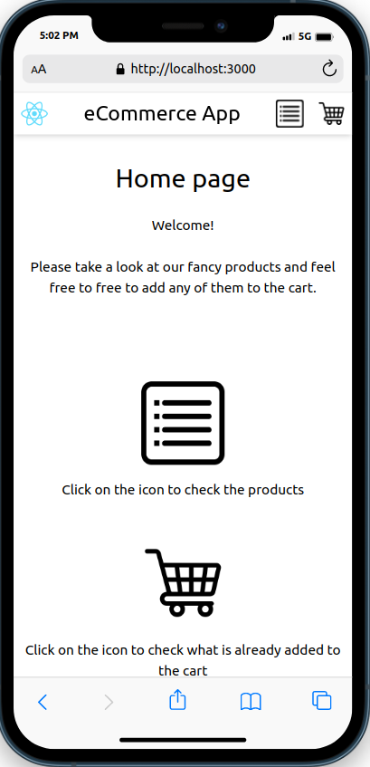

### Desktop version

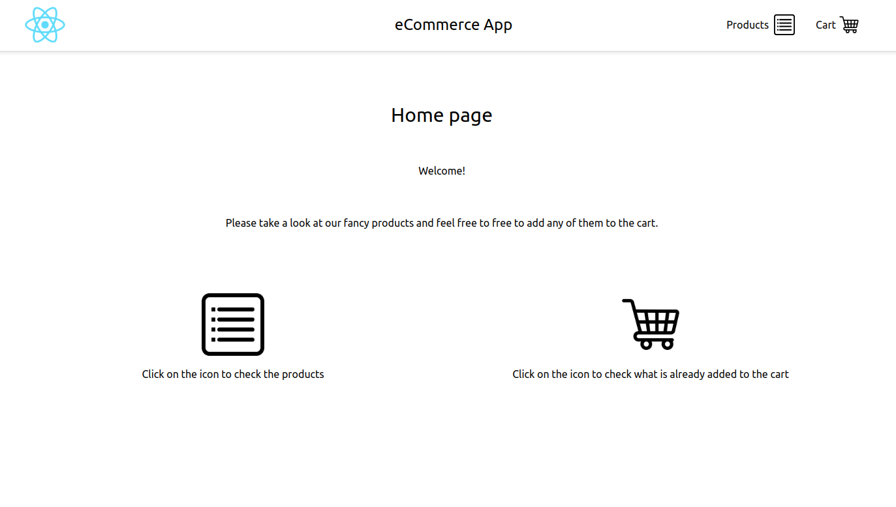

## Header

It contains the logo and the name of the application.

It also contains quick links for the products and cart pages.
The mobile version only shows the icons.
The tablet and desktop versions also show the names for the links.

The header is sticky for mobile and tablet but it scrolls with the page for desktop.

### Mobile version
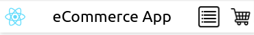

### Desktop version
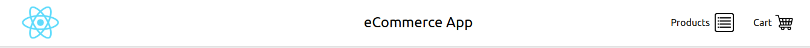

The minicart icon also displays the number of products (not the quantities for products) in the cart if there is anything in the cart.

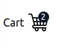

## Product Listing Page

The user can view the products. 
The user can add the product to the cart with respect of the following rules:
- The product cannot be added to the cart if the desired specified amount is greater than the available amount.
- There is a minimum order amount when specifying the quantity otherwise the product won't be added

When the product is added to the page the product displays the decremented value.

Link: http://localhost:3000/products

When adding a product successfully the following popup is displayed.
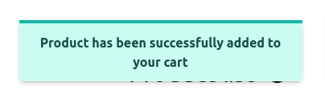

This is an example for the error popup when the rules are not met.
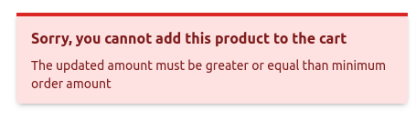

### Mobile version
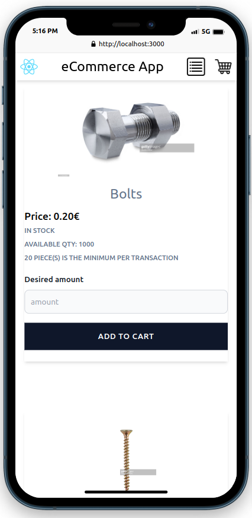

### Desktop version
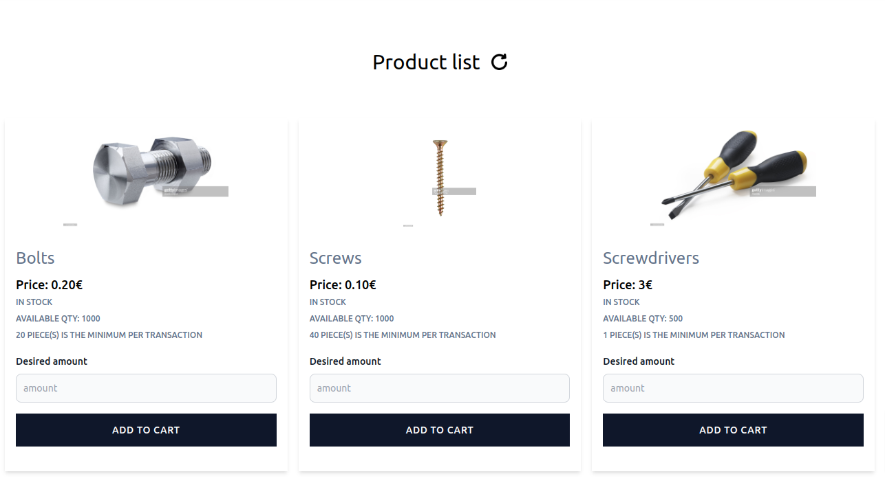

### Product Title

It contains a Refresh icon. When clicking on it it hard reloads everything, resetting the states, emptying everything from the cart and refetching the products from the api endpoint resetting the attributes.

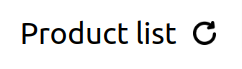

### Product Item

The following product information are displayed: image, name, price, stock status, input field for the amount and the add to cart button.

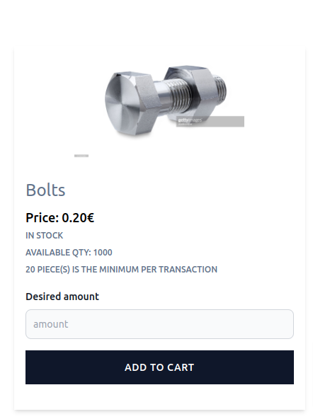

When the product is NOT available because of out of stock the following is displayed instead.
The user cannot add more amount of that product to the cart and the button is disabled.

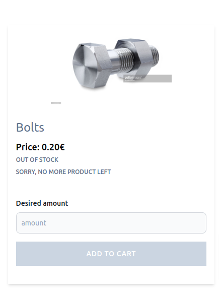

## Cart Page

The user can update or remove any (or all) product in the cart.
The same rules are applied as well when updating any product:
- The product cannot be added to the cart if the desired specified amount is greater than the available amount.
- There is a minimum order amount when specifying the quantity otherwise the product won't be added

When the product is removed from the cart the product gets back the quantity on the product listing page.

Link: http://localhost:3000/cart

When updating a product successfully the following popup is displayed.


This is an example for the error popup when the rules are not met.


### Mobile version
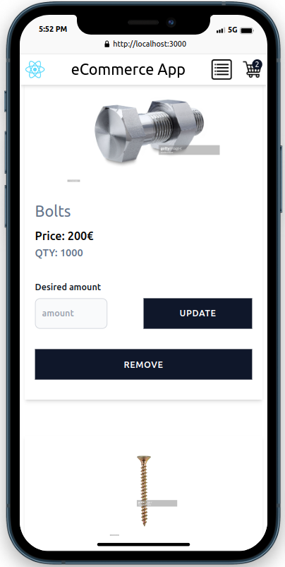

### Desktop version
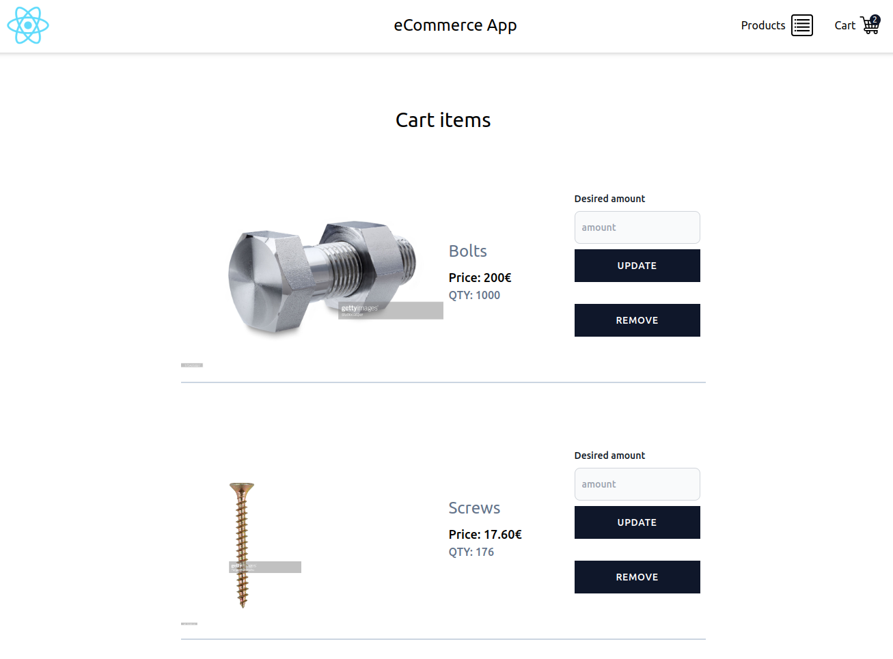

## Totals

It displays the total amount and the total price of the items.
Clicking on the "Remove All" button removes all the product from the cart.

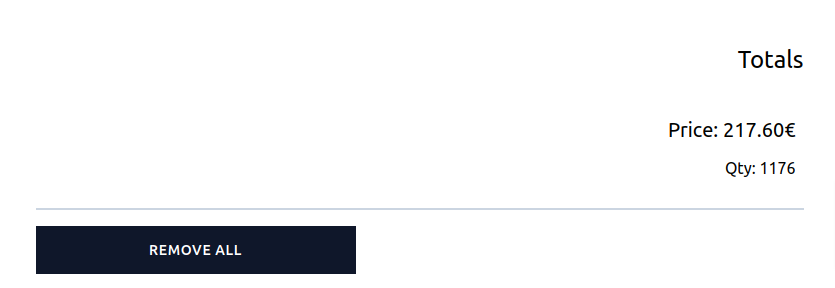

## Cart Item

It displays information about the product: image, name, total price, total amount, action buttons for updating or removing the item.

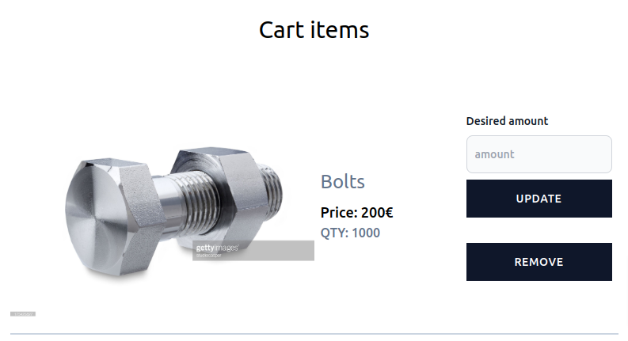

## Action Buttons

The user can update the cart as per the rules mentioned above.
When removing the product along with the quantities it will be removed from the list.

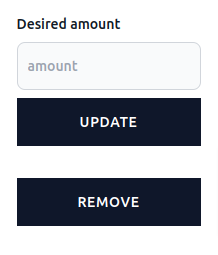

## Empty Cart

This is how the empty cart looks.

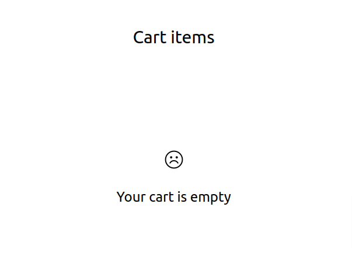

# Good-to-have in the future
- Setting expiration for the cart items
- Translations
- Adding tests for reducers
- Adding Storybook
